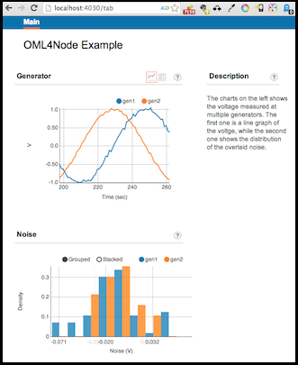

Examples
========

This directory contains a few example files using the 'oml' module

Generator
---------

The `generator.js` file implements a simple simulation of two sine-wave generators with 
a sensor attached to each of them which reports a voltage reading every second.

The following will print the OMSP stream to the console

    % node generator.js
    protocol: 4
    content: text
    domain: unknown_domain
    start-time: 1386829230
    sender-id: localhost-65448
    app-name: gen
    schema: 0 _experiment_metadata subject:string key:string value:string
    
    0 0 1 . schema  1 gen_voltage generator:string voltage:double noise:double
    1.3259999752044678  1 1 gen1  0.03484775889800397 0.03484775889800397
    ...
    
To write the measurements into a file, let's say `/tmp/gen.omsp` use the following:

    % node generator.js --oml-collect file:/tmp/gen.omsp
    
To visualize the measurements you can use the __omf_web__ ruby gem. For that you would 
need a working __ruby1.9__ installation. Then install the necessary gems with:

    % bundle install --path vendor
    
After that start the web server from the same directory but in a different shell:

    % bundle exec omf_web_server --config generator_viz.yaml start
    
and then start the simulator

    % node generator.js --oml-collect tcp:localhost:3003

Finally, point your web browser to [http://localhost:4030](http://localhost:4030) 
and you should see something like:

